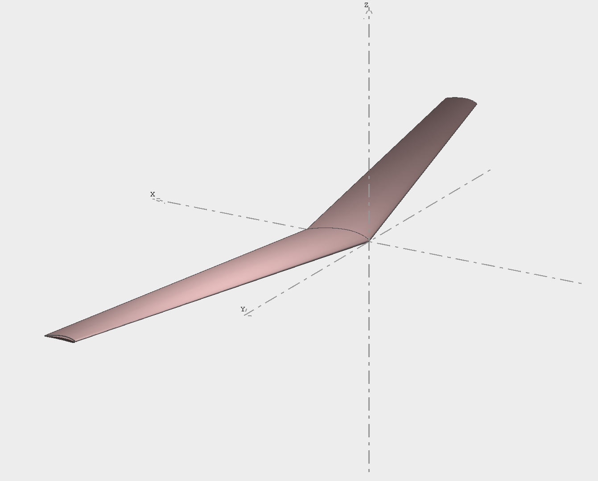

# glider-airfoil-design-study
## Summary
This project studies justification process for the optimal airfoil camber, AOA, taper ratio, sweep angle to for a 1 meter wingpan unpowered glider. 

## Finalized Wing Specifications
NACA 5412  
7.5° Angle of Attack  
0.5 Taper Ratio  
15° Sweep Angle  

## Xfoil Direct Design Analysis
Overview
This study uses XFLR5 to parametrically justify four key design parameters for a hand-launched glider:
Parameter	Method	Result
Camber	XFoil Direct Analysis — 10 airfoils	NACA 5412
Best AoA	Cl/Cd vs Alpha curve	7.5°
Taper ratio λ	VLM2 spanwise Cl distribution	λ = 0.5
Sweep angle Λ	VLM2 Cm vs Alpha slope	Λ = 15°
